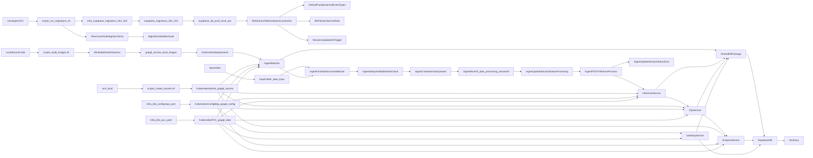

# GRAPPL Data Flow Diagram

```mermaid
flowchart LR
  devOperator[DeveloperOrCI] --> runMigrationsScript[scripts_run_migrations_sh]
  runMigrationsScript --> supabaseMigrationsInfra[infra_supabase_migrations_001_010]
  supabaseMigrationsInfra --> supabaseMigrationsCliMirror[supabase_migrations_001_010]
  supabaseMigrationsCliMirror --> supabaseCliPush[supabase_db_push_local_yes]
  supabaseCliPush --> dbSchema[DbSchemaTablesIndexesConstraints]
  dbSchema --> dbSeedData[DefaultPractitionerAndEventTypes]
  dbSchema --> dbRlsPolicies[RlsPoliciesServiceRole]
  dbSchema --> dbSessionsTrigger[SessionsUpdatedAtTrigger]
  runMigrationsScript --> migrationChecks[RowCountAndIntegrityChecks]
  migrationChecks --> buildValidationGate[MigrationValidationGate]

  localSource[LocalSourceCode] --> buildScript[scripts_build_images.sh]
  buildScript --> minikubeDocker[MinikubeDockerDaemon]
  minikubeDocker --> localImages[grappl_service_local_images]
  localImages --> k8sDeployments[KubernetesDeployments]
  k8sDeployments --> ingestWatcher[IngestWatcher]
  envLocal[.env_local] --> createSecretsScript[scripts_create_secrets.sh]
  createSecretsScript --> grapplSecrets[KubernetesSecret_grappl_secrets]
  configmapYaml[infra_k8s_configmap_yaml] --> grapplConfig[KubernetesConfigMap_grappl_config]
  pvcYaml[infra_k8s_pvc_yaml] --> grapplDataPvc[KubernetesPVC_grappl_data]

  inputVideo[InputVideo] --> inputFolder[InputFolder_data_input]
  inputFolder --> ingestFsWatcher[IngestFsnotifyRecursiveWatcher]
  ingestFsWatcher --> ingestSettleCheck[IngestDelayAndStableSizeCheck]
  ingestSettleCheck --> ingestCreateSession[IngestCreateSessionQueued]
  ingestCreateSession --> ingestMoveFile[IngestMoveTo_data_processing_sessionId]
  ingestMoveFile --> ingestMarkProcessing[IngestUpdateSessionStatusProcessing]
  ingestMarkProcessing --> ingestPostInference[IngestPOSTInferenceProcess]
  ingestPostInference --> inferenceService[InferenceService]
  ingestPostInference --> ingestMarkError[IngestUpdateSessionStatusError]
  ingestWatcher[IngestWatcher] --> ingestFsWatcher
  inferenceService --> clipService[ClipService]
  clipService --> analysisService[AnalysisService]
  ingestWatcher --> sharedDbPackage[SharedDbPackage]
  inferenceService --> sharedDbPackage
  clipService --> sharedDbPackage
  gatewayService[GatewayService] --> sharedDbPackage
  sharedDbPackage --> supabaseDb[SupabaseDB]
  grapplSecrets --> ingestWatcher
  grapplSecrets --> inferenceService
  grapplSecrets --> clipService
  grapplSecrets --> analysisService
  grapplConfig --> ingestWatcher
  grapplConfig --> inferenceService
  grapplConfig --> clipService
  grapplConfig --> analysisService
  grapplConfig --> gatewayService
  grapplDataPvc --> ingestWatcher
  grapplDataPvc --> inferenceService
  grapplDataPvc --> clipService
  grapplDataPvc --> analysisService
  grapplDataPvc --> gatewayService
  analysisService --> supabaseDb
  gatewayService --> supabaseDb
  supabaseDb --> uiLibrary[UILibrary]
```
