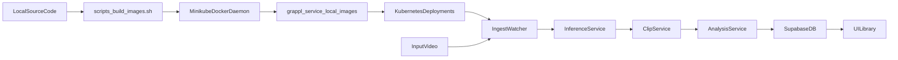

# GRAPPL Data Flow Diagram

```mermaid
flowchart LR
  localSource[LocalSourceCode] --> buildScript[scripts_build_images.sh]
  buildScript --> minikubeDocker[MinikubeDockerDaemon]
  minikubeDocker --> localImages[grappl_service_local_images]
  localImages --> k8sDeployments[KubernetesDeployments]
  k8sDeployments --> ingestWatcher[IngestWatcher]

  inputVideo[InputVideo] --> ingestWatcher[IngestWatcher]
  ingestWatcher --> inferenceService[InferenceService]
  inferenceService --> clipService[ClipService]
  clipService --> analysisService[AnalysisService]
  analysisService --> supabaseDb[SupabaseDB]
  supabaseDb --> uiLibrary[UILibrary]
```
