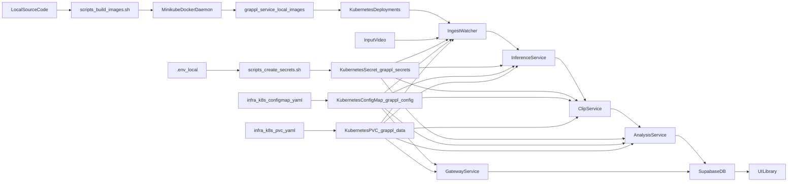

# GRAPPL Data Flow Diagram

```mermaid
flowchart LR
  localSource[LocalSourceCode] --> buildScript[scripts_build_images.sh]
  buildScript --> minikubeDocker[MinikubeDockerDaemon]
  minikubeDocker --> localImages[grappl_service_local_images]
  localImages --> k8sDeployments[KubernetesDeployments]
  k8sDeployments --> ingestWatcher[IngestWatcher]
  envLocal[.env_local] --> createSecretsScript[scripts_create_secrets.sh]
  createSecretsScript --> grapplSecrets[KubernetesSecret_grappl_secrets]
  configmapYaml[infra_k8s_configmap_yaml] --> grapplConfig[KubernetesConfigMap_grappl_config]
  pvcYaml[infra_k8s_pvc_yaml] --> grapplDataPvc[KubernetesPVC_grappl_data]

  inputVideo[InputVideo] --> ingestWatcher[IngestWatcher]
  ingestWatcher --> inferenceService[InferenceService]
  inferenceService --> clipService[ClipService]
  clipService --> analysisService[AnalysisService]
  grapplSecrets --> ingestWatcher
  grapplSecrets --> inferenceService
  grapplSecrets --> clipService
  grapplSecrets --> analysisService
  grapplConfig --> ingestWatcher
  grapplConfig --> inferenceService
  grapplConfig --> clipService
  grapplConfig --> analysisService
  grapplConfig --> gatewayService[GatewayService]
  grapplDataPvc --> ingestWatcher
  grapplDataPvc --> inferenceService
  grapplDataPvc --> clipService
  grapplDataPvc --> analysisService
  grapplDataPvc --> gatewayService
  analysisService --> supabaseDb[SupabaseDB]
  gatewayService --> supabaseDb
  supabaseDb --> uiLibrary[UILibrary]
```
